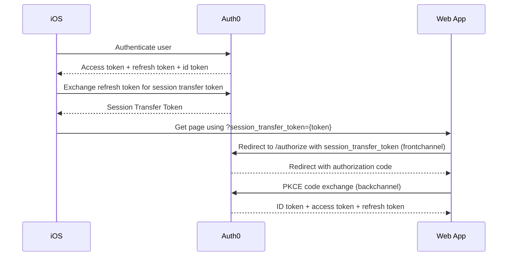

# Native (iOS + Android) to Web (.NET) SSO

This repository contains a proof of concept of native to web Single Sign-On (SSO).

It consists of:

- A web application built with ASP.NET Core that supports SSO via Auth0 and the experimental feature of session transfer
  tokens.
- A native iOS application and a native Android application that authenticates with Auth0 and renders an authenticated
  webview, from the webapp above, without prompting the user for re-login.

| Included apps | SSO                                                                          |
|---------------|------------------------------------------------------------------------------|
| Android       | via shared cookies                                                           |
| iOS           | via query param session transfer                                             |  
| webapp        | consumes session transfer query params, and forwards them to Auth0 authorize |

For more on the native to web SSO flow, see the Auth0 documentation
on https://auth0.com/docs/authenticate/single-sign-on/native-to-web

The session transfer flow is illustrated below:



## Getting started

The code runs locally, but is using Auth0 for authentication, so you will need to create an account.

### Auth0

Create an account and register three applications: one iOS, one Android and one web app.

All applications must be connected to the same Database under the Auth0 **Connections** tab.

#### Enabling session transfer

It is currently *not* possible to enable 'session transfer' through the Auth0 UI, instead, the Auth CLI can be used (
this is currently only supported with a commercial Auth0 license).

For the Android and iOS application:

```bash
auth0 login
auth0 apps session-transfer update {nativeAppClientId} 
```

Note: If `nativeAppClientId` is omitted, a list of all applications will be shown, and you can select the appropriate
one:

```bash
 Client ID: ios-sso-test [Native] (...)
 Can Create Token: Yes
 Allowed Auth Methods: [? for help] (cookie, query) cookie,query                                                                                                                                                                                 Allowed Auth Methods: cookie,query
 Enforce Device Binding: asn
```

And for the web app:

```bash
auth0 apps session-transfer update {webAppClientId} --can-create-token=false --enforce-device-binding=asn
```

```bash
Client ID: web-sso-test [Regular Web Application] (...)
Can Create Token: No
Allowed Auth Methods: [? for help] (cookie, query) cookie                                                                                                                                                                                       Allowed Auth Methods: cookie
Enforce Device Binding: asn
```

TODO Device binding on both???

### iOS

Update `./ios/Auth0.plist` with the Auth0 domain and client id.
Update `ios/Sources/Supporting Files/macOS/macOS.entitlements` with the Auth0 domain.

Run the app from Xcode.

### Android

Update `./android/app/src/main/res/values/strings.xml` with the Auth0 domain and client id.

Run the app from Android Studio.

### Web app

Update `./web/appsettings.json` with the Auth0 domain, client id and client secret.

Initially create a self-signed certificate for HTTPS:

```bash
cd web
dotnet dev-certs https --trust
```

Run the web app:

```bash
dotnet run
```

## Tasks

| Status | Feature                                                                            | Comment                                                                                                                               |
|--------|------------------------------------------------------------------------------------|---------------------------------------------------------------------------------------------------------------------------------------|
| TODO   | Use Post Login Actions to limit session lifetime                                   |                                                                                                                                       |
| TODO   | Use secure cookies over query parameters                                           | Hmm. Passing the token via cookie injection on iOS seems impossible with `SFSafariViewController` and `WKWebView` renders nothing???. |
| TODO   | Enable Allow Refresh Tokens when appropriate to set the refresh tokens as “online” |                                                                                                                                       |
| DONE   | Avoid issuing refresh tokens to web apps unless necessary                          | The web-app is server side rendered...                                                                                                |
| DONE   | Bind session_transfer_token to the device or IP address                            | Using asn. TODO Should it be both app and web? Not sure how it works...                                                               |
| TODO   | Logout / clear cookie on the auth0 side / maybe backchannel logout?                |                                                                                                                                       |

## Notes

Take care to clear cookies on iOS. 'Simulator' -> 'Device' -> 'Erase All Content and Settings'

